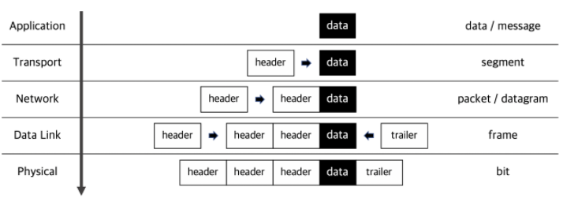

# Network  

## Questions  
* [TCP/IP의 각 계층을 설명해주세요.](#1)  
* [OSI 7계층와 TCP/IP 계층의 차이를 설명해주세요.](#2)  
* [Frame, Packet, Segment, Datagram을 비교해주세요.](#3)  
* [TCP와 UDP의 차이를 설명해주세요.](#4)
* [TCP와 UDP의 헤더를 비교해주세요.](#5)  
* [TCP의 3-way-handshake와 4-way-handshake를 비교 설명해주세요.](#6)  

## Answers  
### #1  
**key_word** : 5개 계층, 각 층의 이름  
* 어플리케이션 계층(L5) : 네트워크 어플리케이션과 어플리케이션 계층 프로토콜이 있는 곳이다. HTTP, SMTP, FTP 같은 많은 프로토콜을 포함한다. DNS를 지원하고 애플리케이션 계층 패킷을 메시지(message)라고 한다.  
* 트랜스포트 계층(L4) : 네트워크 계층에서 보내온 데이터 정렬, 오류 정정 등을 수행하고 신뢰할 수 있는 통신을 확보한다. TCP/UDP 같은 프로토콜이 이 계층에 있다. 트랜스포트 계층 패킷을 세그먼트(segment)라고 한다.  
* 네트워크 계층(L3) : 다른 네트워크에 있는 목적지에 데이터를 전송하는 역할을 수행한다. 네트워크 간의 통신을 가능하게 해주는 역할을 한다. 라우터 장비와 IP 프로토콜, 라우팅 프로토콜이 사용된다. 네트워크 계층의 패킷을 데이터그램(datagram)이라고 한다.  
* 링크 계층(L2) : 네트워크 기기 간 데이터 전송 및 물리 주소를 결정하는 역할을 수행한다. LAN에서 데이터를 정상적으로 주고받기 위해 필요한 계층이다. 일반적으로 이더넷 프로토콜이 사용되고 스위치 같은 장비가 사용된다. 링크 계층의 패킷을 프레임(frame)이라 한다.  
* 물리 계층(L1) : 물리적인 연결과 전기 신호 변환/제어를 담당한다. 컴퓨터와 네트워크 장비를 물리적으로 연결하고 하나의 노드에서 다른 노드로 비트를 이동시키는 역할을 한다.  

### #2  
**Keyword** : OSI는 7, TCP/IP는 5  
OSI 7 계층은 TCP/IP 계층의 어플리케이션 계층을 더 세분화 한것이다.  
* 응용 계층(Application Layer) : 사용자 또는 어플리케이션이 네트워크에 접근할 수 있도록 해주는 계층. 사용자를 위한 인터페이스를 지원하고 사용자에게 보이는 유일한 계층이다. ex) 메일전송, 인터넷 접속  
* 표현 계층(Presentation Layer) : 응용계층으로부터 전달받거나 전송하는 데이터의 인코딩 및 디코딩이 일어나는 계층이다. 데이터를 이해할 수 있도록 응용프로그램에 맞게 변환하게 된다.  
* 세션 계층(Session Layer) : 응용프로세스가 통신을 관리하기 위한 방법을 정의한다. 네트워크상 양쪽의 연결을 관리/지속하는 역할과 세션을 만들거나 없애는 역할을 한다. 통신하는 사용자들을 동기화하고 오류복구를 진행한다. OS가 세션계층에 속한다.  

### #3  
**Keyword** : Packet, Segment, Datagram, Frame(TCP/IP 5계층 기준)  
* Packet : 컴퓨터 간에 데이터를 주고받을 때 네트워크를 통해 전송된느 데이터 조각을 패킷이라고 한다. 송신측은 많은 양의 데이터를 한번에 보내지 않고 일정 단위로 잘라서 보낸다. 수신측에서는 받은 패킷을 다시 조립해서 사용한다.  
* Segment : Transport 계층에서 신뢰할 수 있는 통신을 하기 위한 헤더를 데이터(L5 계층)에 붙임. 이렇게 만든 패킷을 세그먼트라고 부른다.  
* Datagram : Network 계층에서 다른 네트워크와 통신하기 위한 헤더를 세그먼트(L4)에 붙인 것을 데이터 그램이라고 한다.  
* Frame : 데이터 링크 계층에서 물리적인 통신을 위해 패킷(데이터그램)에 헤더와 트레일러를 붙인다.  

### #4  
**Keyword** : 무결성 검사(오류검출), 트랜스포트 다중화/역다중화, 신뢰적인 데이터 전달, 혼잡제어, 연결지향형 서비스  
TCP와 UDP의 공통점은 트랜스포트 다중화/역다중화 기능과 무결성 검사(오류검사)이다. UDP는 비신뢰적인 서비스로서 데이터가 손상되지 않은채로 목적지에 도착하는 것을 보장하지 않고 비연결형 서비스이고 오류검출은 선택사항이다. 비연결형 서비스이므로 연결설정을 위한 지연이 없고 TCP에 비해 패킷 오버헤드가 작다. TCP는 신뢰적인 데이터 전달 기능과 연결지향형 서비스, 혼잡제어 등의 기능을 제공한다. 신뢰적인 데이터 전달은 흐름제어, 순서번호, 확인응답, 타이머 등의 기술을 사용해서 데이터가 순서대로 정확히 전달되도록 역할을 한다. 오류검출은 필수이다.  
### #5  
### #6  