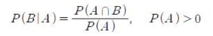
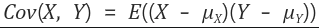
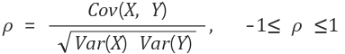

# Statistics/Math  

## Questions  
* [고유값(eigen value)와 고유벡터(eigen vector)에 대해 설명해주세요. 그리고 왜 중요할까요?](#1)  
* [샘플링(Sampling)과 리샘플링(Resampling)에 대해 설명해주세요. 리샘플링은 무슨 장점이 있을까요?](#2)  
* [확률 모형과 확률 변수는 무엇일까요?](#3)  
* [누적 분포 함수와 확률 밀도 함수는 무엇일까요? 수식과 함께 표현해주세요.](#4)  
* [조건부 확률은 무엇일까요?](#5)  
* [공분산과 상관계수는 무엇일까요? 수식과 함께 표현해주세요.](#6)  
* [신뢰 구간의 정의는 무엇인가요?](#7)  
* [p-value를 모르는 사람에게 설명한다면 어떻게 설명하실 건가요?](#8)  
## Answers  
### #1 

Keyword : 정방행렬, PCA, SVD

n*n 정방행렬 A에 대해 Av = λv 를 만족하는 0이 아닌 열벡터 v를 **고유벡터**라 하고 상수 λ를 **고유값**이라 합니다.

고유벡터나 고유값을 기반으로 **특이값 분해(SVD), 주성분 분석(PCA), 유사 역행렬(Pseudo Inverse Matrix)** 등 에 활용하기 때문에 중요합니다.

### #2

Keyword : 표본추출, 모집단 추론, k-fold 교차 검증, 부트스트래핑

**샘플링은 모집단에서 임의의 smapling을 뽑아내는 것으로 표본추출을 의미**한다. 모집단 전체에 대해 조사하는게 어렵기 때문에 sampling을 통하여 모집단을 **추론**하는 것입니다.

**리샘플링은 가지고 있는 샘플에서 다시 샘플 부분집합을 뽑아서 통계량의 변동성을 확인하는 것**입니다.

### #3

Keyword :이산확률변수, 연속확률변수, 확률분포함수, 확률밀도함수, 가우시안정규분포

**확률변수(Random Variable)** 란, 표본 공간의 각 단위 사건에 실수 값을 부여하는 함수입니다. 확률변수는 어떠한 함수로 해석할 수 있으므로 "대문자 X" 라고 표기합니다. 무작위 실험을 했을때, 특정 확률로 발생하는 각각의 결과를 수치적 겂으로 표현하는 변수라고 할 수 있습니다. 

또한 확률 변수에는 **이산확률변수**, **연속확률변수** 두가지 경우가 있습니다. 
- **이산확률변수** 는 확률변수 X가 취할 수 있는 값이 유한하기 때문에 셀수 있는 확률 변수 입니다.
- **연속확률변수** 는 어떠한 두 수 사이에 반드시 다른 수가 존재하는, 셀 수 없는 범위의 확률변수를 가지는 경우에 사용됩니다.

**확률모형** 이란 확률변수를 이용하여 데이터의 분포를 수학적으로 정의한 모형입니다. 데이터 분포를 묘사하기 위해서 사용됩니다. 보통 **확률 분포 함수(probability distribution function)** 또는 **확률 밀도 함수(probability density function)** 를 주로 사용하며, 이 때 함수의 계수를 분포의 모수(parameter)라고 부릅니다. **확률분포(Probability Distribution)** 란 표본공간에 정의된 확률을 이용하여 확률변수의 값 또는 영역에 대한 확률을 표현한 것입니다. 가장 널리 쓰이는 확률 모형의 하나인 **가우시안 정규 분포(Gaussian normal distribution)** 는 다음 과 같은 수식으로 확률 밀도 함수를 정의합니다.

- 확률질량함수(PMF, Probability Mass Function) - 이산형
- 확률밀도함수(PDF, Probability Density Functio) - 연속형
- 누적분포함수(CDF, Cumulative Distribution Functio)

### #4

Keyword : 확률밀도함수(PDF), 누적분포함수(CDF), 미분, 적분

확률 변수 x가 임의의 실수 집합 B에 포함되는 사건의 확률이 음이 아닌 함수 $f$의 적분으로 주어진다고 할때, 

이 때의 X를 연속확률변수라고 하며, 함수 $f(x)$를 **확률밀도함수(PDF, Probability Density Function)** 이라고 합니다. 단 실수 집합 B가 실수 전체일경우 실수 전체에 대한 확률밀도함수의 적분은 1을 만족해야 합니다.

**누적분포함수(Cumulative Distribution Function, CDF)** 는 확률변수가 특정 값보다 작거나 같을 확률을 나타내는 함수입니다. 특정 값을 $a$라고 할때, 누적 분포 함수는 다음과 같이 나타낼 수 있습니다.

확률 밀도 함수와 누적 분포 함수는 미분과 적분의 관계를 갖습니다. 확률 밀도 함수를 음의 무한대에서 특정값 a 까지 적분을 하면, a 에 대한 누적 분포 함수를 얻을 수 있습니다. 반대로 누적 분포 함수를 미분하면 확률 밀도 함수를 얻을 수 있습니다.  

### #5  

**Keyword** : ~가 일어났을때 ~가 일어날 확률  
조건부 확률은 사건 A 가 일어났다는 전제 하에 사건 B 가 일어날 확률이다. 이는 P(B|A) = P(B∩A) / P(A) 로 표현 가능하다.  
  
조건부 확률은 베이즈 정리와도 이어진다.  

### #6  
**Keyword** : 공분산, 상관계수, 단위크기, 단위화  
공분산은 확률변수 X의 편차와 확률변수 Y의 편차를 곱한것의 평균 값이다. 두 변수간에 양의 상관관계가 있는지 음의 상관관계가 있는지는 알지만 상관관계가 얼마나 큰지는 모른다.  
  
공분산의 문제는 확률변수의 단위 크기에 영향을 많이 받는다.  
상관계수는 확률변수의 절대적 크기에 영향을 받지 않도록 공분산을 단위화 시킨 것이다. 공분산에 각 확률변수의 분산을 나누어주었다. 상관계수는 그 상관성이 얼마나 큰지도 알려준다. -1 또는 1에 가까울수록 상관성이 크고 0에 가까울수록 상관성이 작은 것이다.  
  

### #7  

### #8