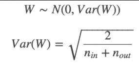

# Deep Learning  

* 딥러닝은 무엇인가요? 딥러닝과 머신러닝의 차이는?  
머신러닝은 학습하려는 데이터의 여러 특징 중에서 어떤 특징을 추출할지 사람이 직접 분석하고 판단하지만 딥러닝의 경우 기계가 자동으로 학습하려는 데이터에서 특징을 추출.  
딥러닝은 신경망을 사용해서 머신러닝 학습을 수행하는 것으로, 머신러닝과는 다르게 데이터를 스스로 학습할 수 있습니다.  

* Cost Function과 Activation Function은 무엇인가요?  
cost function : 모델의 예측값과 정답의 오차를 계산해주는 함수  
activation function : 선형 함수를 비선형함수로 만들어주는 함수 - 비선형 함수로 만들어줌으로써 함수의 표현력을 더 키워준다 !  

* Tensorflow, PyTorch 특징과 차이가 뭘까요?  
tensorflow는 정적그래프이고 pytorch는 동적 그래프이다.  

* Data Normalization은 무엇이고 왜 필요한가요?  
feature들의 분포를 조절하여 균일하게 만드는 방법. 정규화가 필요한 이유는 데이터 feature간 차이가 심하게 나면 모델에 반영이 될수도 있기 때문. 장점: 학습속도가 개선되고 노이즈가 작아지므로 오버피팅 억제하고 데이터를 덜 치우치게 만듬.  

* 알고있는 Activation Function에 대해 알려주세요. (Sigmoid, ReLU, LeakyReLU, Tanh 등)  
    * Sigmoid : sigmoid 함수는 입력을 0~1 사이의 값으로 바꿔준다.입력 값이 크거나 작을 때 기울기가 0에 가까워지는 saturation 문제가 있다.이는 gradient vanishing 문제를 야기하므로 요즘에는 활성화 함수로서 잘 사용되지 않는다.또한 값이 zero-centered 가 아니기 때문에 입력값의 부호에 그대로 영향을 받으므로 경사하강법 과정에서 정확한 방향으로 가지 못하고 지그재그로 움직이는 문제가 있다.  
    * Tanh : tanh 함수는 입력을 -1~1 사이의 값으로 바꿔준다.sigmoid 함수와 마찬가지로 saturation 문제가 있다.  
    * ReLU : ReLU 함수는 입력이 양수면 그대로, 음수면 0을 출력한다.f(x) = max(0, x) 계산 효율과 성능에서 뛰어난 성능을 보여 가장 많이 사용되는 활성화 함수이다. 양의 입력에 대해서는 saturation 문제가 발생하지 않는다. 음의 입력 값에 대해서는 어떤 업데이트도 되지 않는 Dead ReLU 문제가 발생한다.  
    * LeakyReLU : ReLU 와 마찬가지로 좋은 성능을 유지하면서 음수 입력이 0이 아니게 됨에 따라 Dead ReLU 문제를 해결하였다.  

* 오버피팅일 경우 어떻게 대처해야 할까요?  
    * Regularization : Generalization이 잘되도록 모델에 제약을 주며 학습을 하여 overfitting을 방지하는 방법   
    * Early stopping : training loss는 계속 낮아지더라도 validation loss는 올라가는 시점을 overfitting으로 간주하여 학습을 종료하는 방법  
    * Parameter norm penalty (weight decay) : 비용함수에 제곱을 더하거나( -Regularization) 절댓값을 더해서( -Regularization) weight의 크기에 페널티를 부과하는 방법  
    * Data augmentation : 훈련 데이터의 개수가 적을 때, 데이터에 인위적으로 변화를 주어 훈련 데이터의 수를 늘리는 방법  

* 하이퍼 파라미터는 무엇인가요?  
최적의 훈련 모델을 구현하기 위해 모델에 설정하는 변수. 사용자가 직접 설정해주는 값을 뜻함. ex) 학습률, 손실 함수, 일반화 파라미터, 미니배치 크기 등  
* Weight Initialization 방법에 대해 말해주세요. 그리고 무엇을 많이 사용하나요?  
    * Lecun Initialization  
    Lenet의 창시자 LeCun이 제시한 방법으로 들어오는 노드 수에 대해 정규 분포와 균등 분포를 따르는 방법이 있음.  
        * 정규분포  
          
        * 균등분포  
          
    * Xavier Initialization  
    구조는 Lecun의 초기화 방법과 유사하지만 다음 층의 노드 수도 사용하고, 많은 연구를 통해 가장 최적화된 상수값 또한 찾음.  
        * 정규분포  
          
        * 균등분포  
          
    * He Initialization  
    ReLu를 활성화 함수로 사용시 Xavier 초기값 설정이 비효율적인 결과를 보여서 사용하는 방법. ReLU와 함께 많이 사용되는 방법이고 LeCun 방법과 같지만 상수를 다르게 하고 들어오는 노드만 고려함.  
        * 정규분포  
          
        * 균등분포  
          
   

* 볼츠만 머신은 무엇인가요?  
**keyword** : 가시층, 은닉층, 완전그래프  
볼츠만 머신은 가시층과 은닉층 두개의 층으로 신경망을 구성하는 방법이다. 볼츠만 머신은 모든 뉴런이 연결되어 있는 완전 그래프 형태이고 제한된 볼츠만 머신은 같은 층의 뉴런이 연결되어 있지 않은 모양이다.

* TF, PyTorch 등을 사용할 때 디버깅 노하우는?  
오류가 날꺼 같은 지점에서 print문을 이용하거나 디버깅 포인트로 잡기.  

* 뉴럴넷의 가장 큰 단점은 무엇인가? 이를 위해 나온 One-Shot Learning은 무엇인가?  
답을 내기 위해서 답에 대한 많은 데이터를 학습해야함. One-shot Learning은 뉴럴넷도 새로운 레이블을 지닌 데이터가 적을 때에도 모델이 좋은 성능을 내도록 사용되는 방법.  
* 요즘 sigmoid 보다 ReLU를 많이 쓰는데 그 이유는?  
기울기 소실 문제의 이유가 있다. ReLU값이 양수일 때, 기울기가 1이므로 연쇄 곲이 1보다 작아지는 것을 어느정도 막아줄 수 있다.  
 

* Gradient Descent에 대해서 설명한다면?  
    함수의 극소점을 찾기 위해 gradient 반대 방향으로 이동해가는 방법. loss function을 최소화하기 위해 파라미터에 대해 loss function을 미분하여 그 기울기값을 구하고 경사가 하강하는 방향으로 파라미터 값을 점진적을 찾기위해 사용함.  
    * 적절한 step size : step size가 큰 경우 한 번 이동하는 거리가 커지므로 빠르게 수렴할 수 있다는 장점이 있다. 하지만, step size를 너무 크게 설정해버리면 최소값을 계산하도록 수렴하지 못하고 함수 값이 계속 커지는 방향으로 최적화가 진행될 수 있다. 한편 step size가 너무 작은 경우 발산하지는 않을 수 있지만 최적의 x를 구하는데 소요되는 시간이 오래 걸린다는 단점이 있다.  
    * local minima 문제 : step size가 큰 경우 한 번 이동하는 거리가 커지므로 빠르게 수렴할 수 있다는 장점이 있다. 하지만, step size를 너무 크게 설정해버리면 최소값을 계산하도록 수렴하지 못하고 함수 값이 계속 커지는 방향으로 최적화가 진행될 수 있다. 한편 step size가 너무 작은 경우 발산하지는 않을 수 있지만 최적의 x를 구하는데 소요되는 시간이 오래 걸린다는 단점이 있다.  
    * minima에 들어갔다가 나오는 경우  
    Back Propagation에 대해 설명 한다면?  
    역전파 알고리즘은 Loss에 대한 입력값의 기울기(미분값)를 출력층 layer에서부터 계산하여 거꾸로 전파시키는 것이다.  

    * Training 세트와 Test 세트를 분리하는 이유는?  
    학습한 데이터에 대해서는 성능이 잘 나오지만 한번도 본적 없는 데이터에 대해서도 좋은 결과를 내기 위해서 한번도 본적이 없는 test 세트를 이용해서 성능을 판단한다.  
    * Validation 세트가 따로 있는 이유는?  
    train data로 학습을 시키고 valid를 통해 모델의 성능 평가를 하고 좋은 방향으로 모델을 수정하고 최종적으로 만들어진 모델로 test 데이터로 최종 성능 평가를 한다. train과 test로만 하면 결국 test에 오버피팅 될수 있기 때문.  
    * Test 세트가 오염되었다는 말의 뜻은?  
    test 데이터가 train과 유사하거나 포함된 경우를 말함.  
    * Regularization이란 무엇인가?  
    모델의 오버피팅을 막고 일반화를 하는 것   

* Batch Normalization의 효과는?  
배치 정규화(Batch Normalization)은 학습 시 미니배치 단위로 입력의 분포가 평균이 0, 분산이 1이 되도록 정규화한다. 더불어 로 스케일과 로 이동 변환을 수행한다. 이렇게 배치 정규화를 사용하면 다음과 같은 효과를 얻을 수 있다. 장점 1 기울기 소실/폭발 문제가 해결되어 큰 학습률을 설정할 수 있어 학습속도가 빨라진다. 장점 2 항상 입력을 정규화시키기 때문에 가중치 초깃값에 크게 의존하지 않아도 된다. 장점 3 자체적인 규제(Regularization) 효과가 있어 Dropout이나 Weight Decay와 같은 규제 방법을 사용하지 않아도 된다.  

* Dropout의 효과는?  
드롭아웃(Dropout)은 설정된 확률 만큼 은닉층(hidden layer)에 있는 뉴런을 무작위로 제거하는 방법으로, 오버피팅을 방지하기 위한 방법 중 하나이다. (정확히는 출력을 0으로 만들어 더이상의 전파가 되지 않도록 한다.) 드롭아웃(Dropout)은 학습 때마다 무작위로 뉴런을 제거하므로 매번 다른 모델을 학습시키는 것으로 해석할 수 있다. 그리고 추론 시 출력에 제거 확률 를 곱함으로써 앙상블 학습에서 여러 모델의 평균을 내는 효과를 얻을 수 있다.  

* BN 적용해서 학습 이후 실제 사용시에 주의할 점은? 코드로는?  
학습 과정에서는 미니 배치의 평균과 분산을 계산하여 배치 정규화를 적용하지만, 추론 시에는 학습 데이터 전체에 대한 평균과 분산을 계산하여 적용을 해야 한다. 왜냐하면 사용자가 설정한 배치의 크기에 따라 추론 결과가 변할 수도 있기 때문이다.  

* GAN에서 Generator 쪽에도 BN을 적용해도 될까?  
일반적으로 GAN에서는 생성기(Generator)의 출력층(Output Layer)에만 BN(Batch Normalization)을 적용하지 않는다. 왜냐하면 생성기가 만든 이미지가 BN을 지나면 실제 이미지와는 값의 범위가 달라지기 때문이다.  
