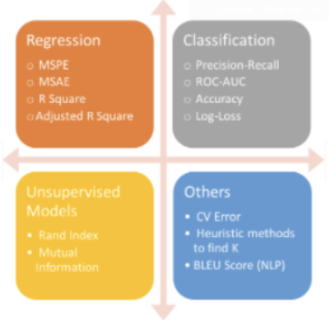

# Machine Learning  

* 알고 있는 metric에 대해 설명해주세요. (ex. RMSE, MAE, recall, precision ...)  

* 정규화를 왜 해야할까요? 정규화의 방법은 무엇이 있나요?  
data가 가진 feature의 스케일이 심하게 차이가 나는 경우 문제가 되기 때문.  
ex) min-max, Z-score  
min-max : 가장 일반적인 방법 모든 feature에 대해 0과 1사이의 값으로 변환 하는 것. 모든 feature의 스케일이 동일. 치명적인 단점: 이상치에 너무 많은 영향을 받음.  
(X - MIN) / (MAX-MIN)  
Z-score :  이상치 문제를 피하는 데이터 정규화 전략  
(X - 평균) / 표준편차  
계산되는 음수와 양수의 크기는 그 feature의 표준편차에 의해 결정됨. 이상치를 잘 처리하지만 정확히 동일한 척도로 정규화 된 데이터를 생성하지는 않음.  

* Local Minima와 Global Minima에 대해 설명해주세요.  
  
cost function에서 global minima는 에러가 최소화되는 점이고 local minima는 에러가 최소가 될 수 있는 후보가 되는 지점 중 global minima를 뺀 지점을 말함. local minima는 자칫 에러가 최소화되는 지점이라고 착각할 수 있음.  
* 차원의 저주에 대해 설명해주세요.  
차원의 저주란 데이터 차원이 증가할수록 해당 공간의 크기가 기하급수적으로 증가하여 데이터 간 거리가 기하급수적으로 멀어지고 희소한 구조를 갖게 되는 현상. 차원을 증가시킨만큼 데이터를 추가하거나 차원축소 알고리즘으로 차원을 축소해야함  

* dimension reduction기법으로 보통 어떤 것들이 있나요?  
차원 축소는 피처 선택(feature selection)과 피처 추출(feature extraction)으로 나눌 수 있다. 우선 피처 선택은 특정 피처에 종속성이 강한 불필요한 피처는 제거하고 데이터의 특징을 잘 표현하는 주요 피처만 선택하는 것을 말한다. 반면 피처 추출은 기존 피처를 저차원의 피처로 압축하여, 피처를 함축적으로 잘 설명할 수 있도록 저차원으로 매핑하는 것을 말한다. 대표적인 피처 추출 알고리즘으로 PCA, SVD, NMF, LDA 등이 있다.  

* PCA는 차원 축소 기법이면서, 데이터 압축 기법이기도 하고, 노이즈 제거기법이기도 합니다. 왜 그런지 설명해주실 수 있나요?  
PCA(Principle Component Analysis)는 입력 데이터의 공분산 행렬을 기반으로 고유벡터를 생성하고 이렇게 구한 고유 벡터에 입력 데이터를 선형 변환하여 차원을 축소하는 방법이다. 차원은 곧 입력 데이터의 피처를 뜻하므로 데이터 압축 기법으로 볼 수도 있다. 또한 PCA는 고유값이 가장 큰, 즉 데이터의 분산이 가장 큰 순으로 주성분 벡터를 추출하는데, 가장 나중에 뽑힌 벡터보다 가장 먼저 뽑힌 벡터가 데이터를 더 잘 설명할 수 있기 때문에 노이즈 제거 기법이라고도 불린다.

* LSA, LDA, SVD 등의 약자들이 어떤 뜻이고 서로 어떤 관계를 가지는지 설명할 수 있나요?  
    * LSA(Latent Semantic Analysis)  
    잠재 의미 분석을 말하고 주로 토픽 모델링에 자주 사용되는 기법이다. 문서 집합에 숨어 있는 주제를 찾아내는 텍스트 마이닝기법 중 하나이다.  
    * LDA(Latent Dirichlet Allocation)  
    토픽모델링 기법 중 하나이다. 지도학습에서 적용하는 차원 축소 기법이자 입력 데이터의 클래스를 최대한 분리할 수 있는 축을 찾는 기법이다.  
    * SVD(Singular Value Decomposition)  
    정사각행렬이 아닌 m*n 형태의 다양한 행렬을 분해하며, 이를 특이값 분해라 한다. 이때 분해되는 행렬은 두 개의 직교 행렬과 하나의 대각행렬이며, 두 직교행렬에 담긴 벡터가 특이벡터이다.  
* Markov Chain을 고등학생에게 설명하려면 어떤 방식이 제일 좋을까요?  
마코프 체인은 마코프 성질을 지닌 이산 확률 과정이다. n+1회의 상태는 오직 n회에서의 상태, 혹은 그 이전 일정 기간의 상태에만 영향을 받는 것을 의미한다.  

* 텍스트 더미에서 주제를 추출해야 합니다. 어떤 방식으로 접근해 나가시겠나요?  
LDA 방법  
문서의 집합에서 토픽을 찾아내는 대표적인 알고리즘. 문서들은 토픽들의 혼합으로 구성되어 있고 토픽들은 확률분포에 기반하여 단어들을 생성한다고 가정. 데이터가 주어지면 LDA는 토픽을 문서가 생성되던 과정을 역추적. 각 문서의 토픽 분포와 각 토픽 내의 단어 분포를 추정  
https://huidea.tistory.com/130
* SVM은 왜 반대로 차원을 확장시키는 방식으로 동작할까요? SVM은 왜 좋을까요?  
장점 : 분류와 회기에 모두 사용할 수 있다. 신경망 기법에 비해 오버피팅 정도가 낮다. 예측의 정확도가 높다. 저차원과 고차원 모두에 잘 작동한다.  

* 다른 좋은 머신 러닝 대비, 오래된 기법인 나이브 베이즈(naive bayes)의 장점을 옹호해보세요.  
데이터에서 변수들에 대한 조건부 독립을 가정하는 알고리즘으로 클래스에 대한 사전 정보와 데이터로부터 추출된 정보를 결합하고, 베이즈 정리를 이용하여 어떤 데이터가 특정 클래스에 속하는지 분류하는 알고리즘.  
장점 : 단순하고 빠르며 매우 효과적, 노이즈와 결측 데이터가 있어도 잘 수행함, 훈련에 대한 상대적으로 적은 예제가 필요하지만 매우 많은 예제도 수행함, 예측에 대한 추정된 확률을 얻기 쉬움.  
* 회귀 / 분류시 알맞은 metric은 무엇일까?  
분류의 경우 : 이진분류이면 Binary Crossentropy, 분류해야할 클래스가 3개 이상이면 Categorical Crossentropy  
회귀의 경우 : R^2 결정계수 : 독립변수의 개수가 많아질수록 결정 계수가 1에 가까워진다.  

* Association Rule의 Support, Confidence, Lift에 대해 설명해주세요.  
    * Support(지지도) : 전체 거래 중 항목 A와 항목 B를 동시에 포함하는 거래의 비율로 정의한다.  
    * Confidence(신뢰도) : 항목 A를 포함한 거래 중에서 항목 A와 항목 B가 같이 포함될 확률이다. 연관성의 정도를 파악할 수 있다.  
    * Lift(향상도) : A가 구매되지 않았을 때 품목 B의 구매확률에 비해 A가 구매됐을 때 품목 B의 구매확률의 증가 비이다. 연관규칙 A→B는 품목 A와 품목 B의 구매가 서로 관련이 없는 경우에 향상도가 1이 된다.

* 최적화 기법중 Newton’s Method와 Gradient Descent 방법에 대해 알고 있나요?  
    * Newton's Method : 현재 x값에서 접선을 그리고 접선이 x축과 만나는 지점으로 x를 이동시켜 가면서 점진적으로 해를 찾는 방법 초기값을 잘 주면 금방 해를 찾을 수 있지만 잘못 주면 시간이 오래 걸리거나 아예 해를 찾지 못할 수 있다.  
    * Gradient Descent : 미분하여 극소점을 찾아가는 방법 (local minimum에 빠질수도 있다는 문제점이 있다) 모든 차원과 모든 공간에서 적용이 가능

* 머신러닝(machine)적 접근방법과 통계(statistics)적 접근방법의 둘간에 차이에 대한 견해가 있나요?  
    머신러닝은 모델의 성능을 높이는게 목적  
    통계는....?  
    * 인공신경망(deep learning이전의 전통적인)이 가지는 일반적인 문제점은 무엇일까요?  
    딥러닝 이전에는 선형적으로만 수행하여 레이어를 깊게 쌓지 못해서 복잡한 문제를 풀 수 없었다.  
    * 지금 나오고 있는 deep learning 계열의 혁신의 근간은 무엇이라고 생각하시나요?  
    GPU의 발전?, 좋은 데이터  ㄴ

* ROC 커브에 대해 설명해주실 수 있으신가요?  
ROC 커브는 이진분류 모델의 성능을 나타내는 지표이다. 모델이 참이라고 예측하는 경우는 FPR (False Positive Rate, 실제 값이 거짓일 때) 과 TPR (True Positive Rate, 실제 값이 참일 때) 두 경우로 나뉜다. FPR 과 TPR 을 그래프에서 x 축, y 축으로 동시에 표현한 ROC 커브를 통해 모델이 얼마나 옳은 값을 잘 예측하는지 알 수 있게 된다.  

* 여러분이 서버를 100대 가지고 있습니다. 이때 인공신경망보다 Random Forest를 써야하는 이유는 뭘까요?  
랜덤 포레스트는 여러 결정 트리를 앙상블하여 하나의 모델로 구성하는 방법이다. 랜덤 포레스트에서는 각 서버를 모델의 특성을 이해하는 단일 결정 트리 (Decision tree) 로 병렬적이게 구성할 수 있다. 반면, 인공신경망은 하나의 서버 자체가 모델의 특성을 모두 이해하는 end-to-end 구조로 직렬적이게 구성된다. 따라서 서버가 100대 있을 때는, 이를 병렬적으로 활용할 수 있는 랜덤 포레스트를 사용한다.  
