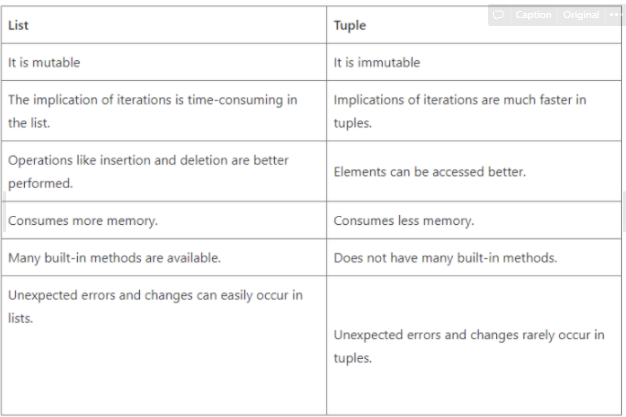

# Python  

* What is the difference between list and tuples in Python?  
  
* What are the key features of Python?  
python은 interpreter language이다. 실행전에 컴파일할 필요가 없음. 또한 동적 타이핑이다. 실행시간에 자료형을 검사 자료형 명시할 필요 없음. 클래스의 구성 및 상속을 정의할 수 있다는 점에서 객체 지향 프로그램에 적합함. 파이썬에서 함수와 클래스는 일급 객체이다. 들여쓰기와 간결하고 쉬운 문법을 통해 코드를 작성할 수 있음  

* What type of language is python? Programming or scripting?  
파이썬은 스크립트 언어이고 프로그래밍 언어로도 볼 수 있음. 일반적인 경우 프로그래밍언어로 분류 함. 스크립트 언어: 컴파일이 필요없이 실행될수 있는 명령어의 집합. 인터프리터를 사용함.  

* Python an interpreted language. Explain.  
인터프리터 언어는 실행시간 전에 machine-level-code를 만드는 컴파일 언어와 다르게 소스코드를 바로 실행하는 언어이다.  
