# Statistics/Math  

* 고유값(eigen value)와 고유벡터(eigen vector)에 대해 설명해주세요. 그리고 왜 중요할까요?  
n*n 정방행렬 A에 대해 Av = λv 를 만족하는 0이 아닌 열벡터 v를 고유벡터라 하고 상수 λ를 고유값이라 합니다.
고유벡터나 고유값을 기반으로 특이값 분해(SVD), 주성분 분석(PCA), 유사 역행렬(Pseudo Inverse Matrix) 등 에 활용하기 때문에 중요합니다.  

* 샘플링(Sampling)과 리샘플링(Resampling)에 대해 설명해주세요. 리샘플링은 무슨 장점이 있을까요?  
샘플링은 모집단에서 임의의 smapling을 뽑아내는 것으로 표본추출을 의미한다. 모집단 전체에 대해 조사하는게 어렵기 때문에 sampling을 통하여 모집단을 추론하는 것입니다.
리샘플링은 가지고 있는 샘플에서 다시 샘플 부분집합을 뽑아서 통계량의 변동성을 확인하는 것입니다.  

* 확률 모형과 확률 변수는 무엇일까요?  

확률변수(Random Variable) 란, 표본 공간의 각 단위 사건에 실수 값을 부여하는 함수입니다. 확률변수는 어떠한 함수로 해석할 수 있으므로 "대문자 X" 라고 표기합니다. 무작위 실험을 했을때, 특정 확률로 발생하는 각각의 결과를 수치적 겂으로 표현하는 변수라고 할 수 있습니다.

또한 확률 변수에는 이산확률변수, 연속확률변수 두가지 경우가 있습니다.

이산확률변수 는 확률변수 X가 취할 수 있는 값이 유한하기 때문에 셀수 있는 확률 변수 입니다.
연속확률변수 는 어떠한 두 수 사이에 반드시 다른 수가 존재하는, 셀 수 없는 범위의 확률변수를 가지는 경우에 사용됩니다.
확률모형 이란 확률변수를 이용하여 데이터의 분포를 수학적으로 정의한 모형입니다. 데이터 분포를 묘사하기 위해서 사용됩니다. 보통 확률 분포 함수(probability distribution function) 또는 확률 밀도 함수(probability density function) 를 주로 사용하며, 이 때 함수의 계수를 분포의 모수(parameter)라고 부릅니다. 확률분포(Probability Distribution) 란 표본공간에 정의된 확률을 이용하여 확률변수의 값 또는 영역에 대한 확률을 표현한 것입니다. 가장 널리 쓰이는 확률 모형의 하나인 가우시안 정규 분포(Gaussian normal distribution) 는 다음 과 같은 수식으로 확률 밀도 함수를 정의합니다.

* 누적 분포 함수와 확률 밀도 함수는 무엇일까요? 수식과 함께 표현해주세요.  
누적 분포 함수는 랜덤 변수가 특정 값보다 작거나 같을 확률을 나타내는 함수이다. '누적'이라는 이름은 특정 값보다 작은 값들의 확률을 모두 누적해서 구한다는 의미에서 붙여진 이름이다.
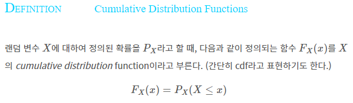  
확률 변수가 임의의 실수 집합에 포함되는 사건의 확률이 다음과 같이 어떤 음이 아닌 함수의 적분으로 주어진다고 할때 이를 연속확률변수라고 하고 함수를 확률 밀도 함수라고 한다. 모든 실수값 x에 대해 f(x)>=0 이고 적분값이 1을 만족해야함. 
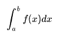

* 조건부 확률은 무엇일까요?  
**Keyword** : ~가 일어났을때 ~가 일어날 확률  
조건부 확률은 사건 A 가 일어났다는 전제 하에 사건 B 가 일어날 확률이다. 이는 P(B|A) = P(B∩A) / P(A) 로 표현 가능하다. 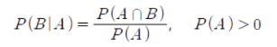  
조건부 확률은 베이즈 정리와도 이어진다.  
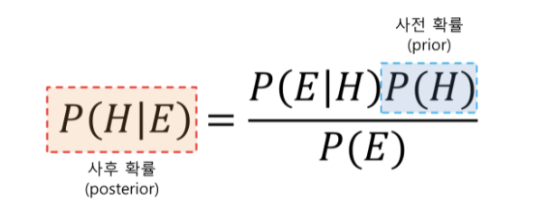
* 공분산과 상관계수는 무엇일까요? 수식과 함께 표현해주세요.  
**Keyword** : 공분산, 상관계수, 단위크기, 단위화
공분산은 확률변수 X의 편차와 확률변수 Y의 편차를 곱한것의 평균 값이다. 두 변수간에 양의 상관관계가 있는지 음의 상관관계가 있는지는 알지만 상관관계가 얼마나 큰지는 모른다.  
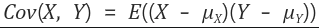  
공분산의 문제는 확률변수의 단위 크기에 영향을 많이 받는다.  
상관계수는 확률변수의 절대적 크기에 영향을 받지 않도록 공분산을 단위화 시킨 것이다. 공분산에 각 확률변수의 분산을 나누어주었다. 상관계수는 그 상관성이 얼마나 큰지도 알려준다. -1 또는 1에 가까울수록 상관성이 크고 0에 가까울수록 상관성이 작은 것이다.
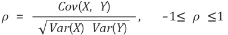

* 신뢰 구간의 정의는 무엇인가요?  
**keyword** : 포함  
신뢰구간은 모수가 실제로 포함될 것으로 예측되는 범위이다. 신뢰구간은 주어진 표본을 사용하여 구한 구간 안에 실제 모집단의 특성치(모평균)이 포함될 가능성이 1-a 임을 의미한다. 즉 신뢰 수준 95%라는 의미는 n개의 표본을 사용하여 신뢰구간을 구하는 과정을 100회 반복하였을 때 그중 95개의 구간은 실제 모수를 포함한다는 것을 뜻한다. (신뢰수준은 방법의 정확도, 참 값을 구하기 위한 작업을 많이 반복했을 때 참 값이 특정 벙위에 있을 비율)  
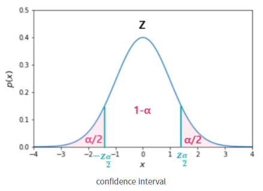  
   

* p-value를 모르는 사람에게 설명한다면 어떻게 설명하실 건가요?  
p-value란 검정 통계량에 관한 확률인데, 우리가 얻은 검정 통계량보다 크거나 같은 값을 얻을 수 있을 확률을 의미한다. p-value는 1종 오류를 범할 확률을 말한다. 1 종오류란 귀무가설이 참인데 기각한 경우. 귀무가설: 모집단의 특성에 대해 옳다고 제안하는 잠정적인 주장 ex) ~와 차이가 없다, ~의 효과는 없다, ~와 같다.  

* R square의 의미는 무엇인가요?  
**keyword** : 독립변수, 종속변수  
R-square는 결정계수로 회귀 모델에서 독립변수가 종속변수를 얼마만큼 설명해 주는지를 가리키는 지표이다.  
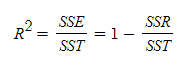  
SST(Total Sum of Squares)  
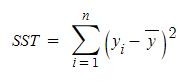  
관측값에서 관측값의 평균(추정치의 평균)을 뺀 결과의 총합  
SSE(Explained Sum of Squares)  
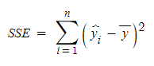  
추정값에서 관측값의 평균(혹은 추정치의 평균)을 뺀 결과의 총합  
SSR(Residual Sum of Squares)  
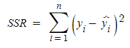
관측값에서 추정값을 뺀 값  

* 평균(mean)과 중앙값(median)중에 어떤 케이스에서 뭐를 써야할까요?  
**keyword** : 전체, 편차  
평균 : 모든 관측값의 합을 자료의 개수로 나눈 것. 평균은 전체 관측값이 반영되므로 대표값으로 가치가 있다. 평균 근처에 표본이 몰려있는 상황에는 유용 그러나 극단적인 값에 영향을 많이 받음.  
중앙값 : 전체 관측값을 크기 순으로 배열했을 때 가운데 위치한 값. 가운데 위치한 값 말고는 중요하지 않음. 평균에 비해 관측값들의 변화에 민감하지 않음. 유용한 경우는 표본의 편차, 왜곡이 심한 경우.  

* 중심극한정리는 왜 유용한걸까요?  
중심극한정리란 표본추출이 무수히 많이 수행되면(보통 30회 이상), 표본 평균의 분포가 정규분포에 수렴한다는 것  중심극한정리가 유용한 이유는 모집단의 형태에 상관없이 표본 평균의 분포가 정규분포를 따르기 때문이다.

* 엔트로피(entropy)에 대해 설명해주세요. 가능하면 Information Gain도요.  
entropy는 주어진 데이터의 혼잡도를 의미하고, entropy는 다음과 같이 데이터가 어떤 클래스에 속할 확률에 대한 기댓값으로 표현할 수 있음. information gain은 어떤 속성을 선택함으로 인해 데이터가 잘 필터링되는지 말하고, 1에서 엔트로피를 뺀 값으로 표현됨.  

* 어떨 때 모수적 방법론을 쓸 수 있고, 어떨 때 비모수적 방법론을 쓸 수 있나요?  
표본의 통계랑을 통해 모집단의 모수를 추정하는 방법을 통계적 추론이라고 한다. 모집단이 어떤 분포를 따른다는 가정 하에 통계적 추론을 하는 방법을 모수적 방법이라고 하고, 표본의 수가 30개 이상일 때 중심극한 정리에 의해 정규분포를 따르므로 모수적 방법론을 사용함.  
모집단의 분포를 가정하지 않는 비모수적 방법은 표본의 수가 30개 미만이거나 정규성 검정에서 정규분포를 따르지 않는다고 증명되는 경우 비모수적 방법론을 사용함. 

* “likelihood”와 “probability”의 차이는 무엇일까요?  
확률(probability): 어떤 시행에서 특정 결과가 나올 가능성. 즉 시행 전 모든 경우의 수의 가능성은 정해져 있고 그 총합은 1이다.  
가능도(likelhood): 어떤 시행을 충분히 수행한 뒤 그 결과를 토대로 경우의 수의 가능성을 도출하는 것. 아무리 충분히 수행해도 어디까지나 추론이기 때문에 가능성의 합이 1이 되지 않을 수 있음.

* 통계에서 사용되는 bootstrap의 의미는 무엇인가요.  
가설 검증을 하거나 메트릭을 계산하기 전에 random sampling을 직용하는 방법이다. 예를들어 어떤 집단에서 값을 측정했을 때, 그 중에서 임의로 100개를 뽑아서 평균을 구하는 것.  
ML에서는 랜덤 샘플링을 통해 training data를 늘리는 방법

* 모수가 매우 적은 (수십개 이하) 케이스의 경우 어떤 방식으로 예측 모델을 수립할 수 있을까요?  
질문에서 모수가 아니라 모집단의 수로 쓰인것 같음  
표본이 매우 작으면 표본평균의 분포가 정규분포를 따른다고 가정할 수 없으므로 비모수적 방법을 이용해서 예측 모델을 수립한다.  
* 베이지안과 프리퀀티스트 간의 입장차이를 설명해주실 수 있나요?  
베이지안은 사건의 확률을 바라볼 때, 사전확률을 미리 생각하고 사건의 발생에 따라 베이즈 정리로 사후 확률을 구해 다시 사전 확률을 업데이트 함. 과거의 사건이 현재 사건에 영향을 끼친다.  
프리퀀티스트는 현재의 객관적인 확률에 의해서만 사건이 발생한다는 입장을 가지고 있음.  

* 검정력(statistical power)은 무엇일까요?  
대립가설 H1이 진실인 경우 귀무가설 H0를 기각할 확률. 효과가 있는 경우 효과가 있다고 잡아낼 확률로서, 말 그대로 효과가 있는 경우 검정 해내는 힘을 뜻한다
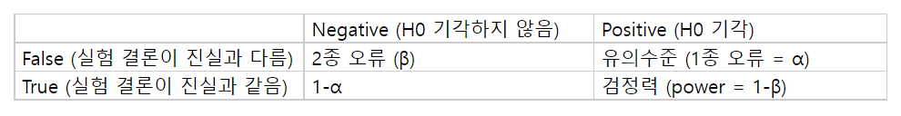

* missing value가 있을 경우 채워야 할까요? 그 이유는 무엇인가요?  
아무것도 하지 않는다. 가장 쉬운 방법이다. 그냥 알고리즘이 누락된 데이터를 처리하게 놔두면 된다. 일부 알고리즘( xgboost)은 결측 값을 고려해서 잘 학습한다. 결측 값을 무시할 수 있는 파라미터를 넣는 알고리즘(LightGBM의 use_missng=false)도 있다. 그러나 처리하는 로직이 없는 알고리즘(sklearn의 LinearRegression)은 누락된 데이터 때문에 엉망진창이 된다. 그런 모델에는 데이터셋을 넣기 전에 누락된 데이터를 처리해야 한다. 제거하기. Missing value를 처리하는 또 다른 한 가지 방법은 누락된 데이터를 제거하는 것이다. 하지만 중요한 정보를 가진 데이터를 잃을 위험이 있다. 상황에 따라 데이터 tuple을 제거하기도 하고 missing value가 많은 feature(column)를 제거하기도 한다. 조금 더 좋은 방법은 누락된 값을 유추하는 것이다. 데이터의 다른 값들로부터 누락된 값을 유추해볼 필요가 있다. 상황에 따라 좋은 방법이 다르다. 어떤 것들을 사용해야 할지 규칙도 있지만, 결국 어떤 게 가장 적합한지는 모델을 통해 실험하고 확인해야 한다. 그때그때 적합한 방법을 사용하자.  

* 아웃라이어의 판단하는 기준은 무엇인가요?  
    * Standard Deviation : 데이터의 분포가 정규 분포를 이룰 때, 데이터의 표준 편차를 이용해 이상치를 탐지하는 방법이다. 각 범위를 정한후 범위를 벗어나는 데이터는 이상치로 간주한다. 여기서 표준 편차는 standard score, sigma, z-score 등의 용어로 대체할 수 있다.  
    * IQR(Interquartile Range) with Box plots : 데이터의 분포가 정규 분포를 이루지 않거나 한 쪽으로 skewed 한 경우, 데이터의 IQR 값을 이용해 이상치를 탐지하는 방법이다. 첫번째 사분위 Q1, 세번째 사분위 Q3 IQR 값은 Q3에서 Q1을 뺀 값이다. (Q1 -1.5*IQR)보다 작거나 (Q3 + 1.5*IQR)보다 큰 데이터는 이상치로 처리한다. 1.5보다 큰 3 혹은 그 이상의 값을 곱하기도 하며 값이 클수록 더욱 최극단의 이상치를 처리함을 알 수 있다.  
    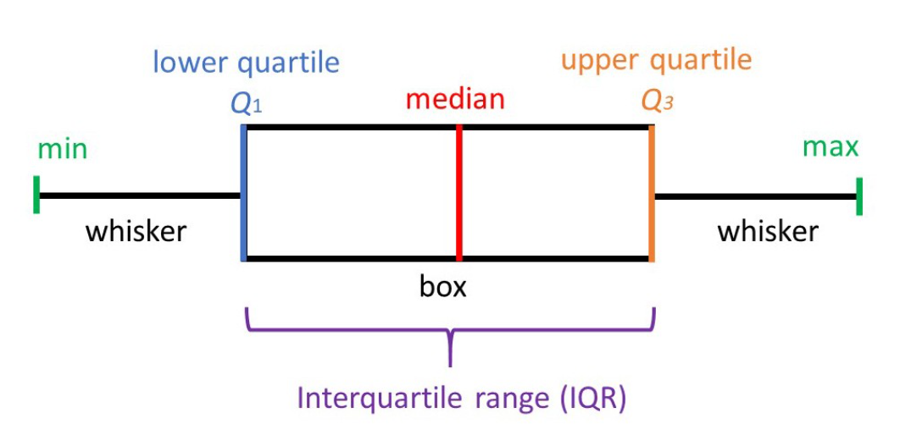  
    * Isolation Forest : 결정 트리 계열의 비지도 학습 알고리즘으로 High dimensional 데이터셋에서 이상치를 탐지할 때 효과적인 방법이다. 데이터셋을 결정 트리 형태로 표현해 정상 데이터를 분리하기 위해서는 트리의 깊이가 깊어지고 반대로 이상티를 트리의 상단에서 분리할 수 있다는 개념을 이용한다. 즉 데이터에서 이상치를 분리하는 것이 더 쉽다는 것이다. 따라서 특정 데이터를 데이터셋에서 분리하기 위해서는 트리에서 몇 번을 분리해야 하는지, 다시 말하면 데이터까지의 경로 길이를 기준으로 데이터가 이상치인지 아닌지를 판단한다. 이때 이상치는 다른 관측치에 비해 짧은 경로 길이를 가진 데이터일 것이다. 이러한 개념을 기반으로 각 데이터에 대해 이상치 점수를 부여할 수 있다. 공식은 아래와 같고 점수는 0에서 1사이로 산출되고 1에 가까울수록 이상치로 간주된다.  
    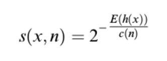  
    * DBScan(Density Based Spatial Clustering of Applications with Noise) : 밀도 기반의 클러스트링 알고리즘으로 어떠한 클러스터에도 포함되지 않는 데이터를 이상치로 탐지하는 방법이다. DBScan 알고리즘은 2가지의 하이퍼파라미터 eps 그리고 MinPts를 요구한다. eps는 두 데이터 사이의 거리가 eps 보다 작거나 같을 때 이들은 같은 클러스터 내에 있는 것으로 간주한다. MinPts는 한 클러스터 내에 존재해야 하는 데이터의 최소 개수이다. 최소 3이상의 값을 가져야 하며 보통은 데이터의 차원에 1을 더한 값 이상으로 설정한다. 이때 eps 거리 내에 MinPts 이상의 데이터를 이웃하는 데이터는 Core Point가 되고 반대로 eps 거리 내에 MinPts 미만의 데이터를 이웃하는 데이터는 Border Point가 된다. 그리고 이들을 제외한 데이터가 바로 이상치가 된다. DBScan 알고리즘은 K-means 알고리즘과 달리 클러스터의 개수를 미리 정하지 않아도 되고 클러스터가 선형적으로 나뉘지 않아 다양한 모양을 가질 수 있다. 다만 데이터의 차원이 높을수록 정확하지 않을 수 있고, eps 하이퍼파라미터를 적절한 값으로 설정하는 것이 어렵다는 단점이 있다.  
    
* 필요한 표본의 크기를 어떻게 계산합니까?