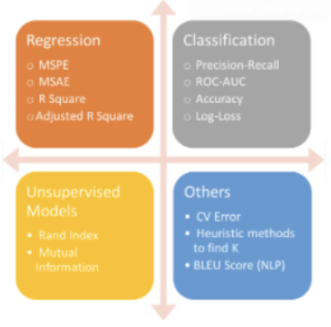

# Week1  
 

## Statistics/Math  
* 고유값(eigen value)와 고유벡터(eigen vector)에 대해 설명해주세요. 그리고 왜 중요할까요?  
정방행렬 A에 대하여 Ax=λx (상수λ가 성립하는 0이 아닌 벡터 x가 존재할 때 상수 λ를 행렬 A의 고유값(eigenvalue), x를 이에 대응하는 고유벡터라고 함. 고유값은 특성값 또는 잠정근이라고도 하고 고유벡터는 특성벡터라고도 함. 행렬 A의 모든 고유값의 집합을 A의 스펙트럼(spectrum)이라고 하고 최대로 서로 다른 n개의 고유값을 가질 수 있음. A의 고유값의 절대값의 최대값을 A의 스펙트럼 반경이라고 함. 모든 벡터 x(1개~n개)를 찾는 것이 할 일  
기하학적인 의미 : 벡터 x에 대해 n차 정방행렬 A를 곱하는 결과와 상수 λ를 곱하는 결과가 같다는 의미. 즉 행렬의 곱의 결과가 원래 벡터와 방향은 같고 배율만 상수 λ만큼만 비례해서 변했다는 의미  

* 샘플링(Sampling)과 리샘플링(Resampling)에 대해 설명해주세요. 리샘플링은 무슨 장점이 있을까요?  
샘플링은 모집단에서 임의의 sampling을 뽑아내는 것으로 표본 추출을 의미.샘플링을 하는 가장 큰 이유는 모집단 전체에 대한 조사는 사실상 불가능해서 모집단에 대해 추론을 함.  
리샘플링이란 모분포의 형태를 알 수 없을 때 현재 갖고 있는 데이터의 일부분을 재추출하여 분포를 만듬.  리샘플링은 내가 가지고 있는 샘플에서 다시 샘플 부분집합을 뽑아서 통계량의 변동성을 확인하는 것. 같은 샘플을 여러 번 사용해서 성능을 측정하는 방식. 예시: k-fold, 부트스르래핑 리샘플링은 표본을 추출하면서 원래 데이터 셋을 복원하기 때문에 이를 통해서 모집단의 분포에 어떤 가정도 필요 없이 표본만으로 추론이 가능하다는 장점이 있다.  

## Deep Learning  
* 딥러닝은 무엇인가요? 딥러닝과 머신러닝의 차이는?  
머신러닝은 학습하려는 데이터의 여러 특징 중에서 어떤 특징을 추출할지 사람이 직접 분석하고 판단하지만 딥러닝의 경우 기계가 자동으로 학습하려는 데이터에서 특징을 추출.  
딥러닝은 신경망을 사용해서 머신러닝 학습을 수행하는 것으로, 머신러닝과는 다르게 데이터를 스스로 학습할 수 있습니다.  

* Cost Function과 Activation Function은 무엇인가요?  
cost function : 모델의 예측값과 정답의 오차를 계산해주는 함수  
activation function : 선형 함수를 비선형함수로 만들어주는 함수 - 비선형 함수로 만들어줌으로써 함수의 표현력을 더 키워준다 !  
    

## Machine Learning  
* 알고 있는 metric에 대해 설명해주세요. (ex. RMSE, MAE, recall, precision ...)  
  
정규화를 왜 해야할까요? 정규화의 방법은 무엇이 있나요?  
data가 가진 feature의 스케일이 심하게 차이가 나는 경우 문제가 되기 때문.  
ex) min-max, Z-score  
min-max : 가장 일반적인 방법 모든 feature에 대해 0과 1사이의 값으로 변환 하는 것. 모든 feature의 스케일이 동일. 치명적인 단점: 이상치에 너무 많은 영향을 받음.  
(X - MIN) / (MAX-MIN)  
Z-score :  이상치 문제를 피하는 데이터 정규화 전략  
(X - 평균) / 표준편차  
계산되는 음수와 양수의 크기는 그 feature의 표준편차에 의해 결정됨. 이상치를 잘 처리하지만 정확히 동일한 척도로 정규화 된 데이터를 생성하지는 않음.  

## Python  
* What is the difference between list and tuples in Python?  
  
* What are the key features of Python?  
python은 interpreter language이다. 실행전에 컴파일할 필요가 없음. 또한 동적 타이핑이다. 실행시간에 자료형을 검사 자료형 명시할 필요 없음.  

## Network
* TCP/IP의 각 계층을 설명해주세요.  
application layer : app과 서비스 인터페이스 제공  
transport layer : 신뢰성 있는 전송기능 제공 TCP/ UDP  
internet layer : transport 계층에서 받은 데이터에 IP패킷 헤더를 붙이고 전송  
network access layer : osi에서 physical + data-link / HW요소 관련  지원  

* OSI 7계층와 TCP/IP 계층의 차이를 설명해주세요.  
레이어 개수 실질적(tcp/ip)인가 개념적(OSI)인가 OSI 7계층 : 네트워크 전송 시 데이터 표준을 정리한 것으로, 개념적 모델로 통신에는 실질적으로 사용되지 않는다. TCP / IP : 연결을 설정하고 네트워크를 통해 통신하는 데 실제로 사용  

## Operating System  
* 프로세스와 스레드의 차이(Process vs Thread)를 알려주세요.  
프로세스는 프로그램을 실행하여 운영체제로부터 자원을 할당받은 작업의 단위이고, 스레드는 프로세스가 할당받은 자원을 이용하는 실행 흐름의 단위로, 프로세스 내 여러개 생길 수 있습니다. 자원 공유 차이. 프로세스가 프로세스간에 통신하려면 IPC사용해야하고, 다른 프로세스의 자료구조나 변수에 접근할 수 없다.  

* 멀티 프로세스 대신 멀티 스레드를 사용하는 이유를 설명해주세요.  
멀티 스레드란 하나의 응용프로그램을 여러 개의 스레드로 구성하고 각 스레드로 하여금 하나의 작업을 처리하도록 하는 것이다. 윈도우, 리눅스 등 많은 운영체제들이 멀티 프로세싱을 지원하고 있지만 멀티 스레드를 기본으로 하고 있다. 웹 서버는 대표적인 멀티 스레드 응용 프로그램이다. 프로그램을 여러개 키는 것보다 하나의 프로그램 안에서 자원을 공유하며 여러작업을 해결하는 것이 자원의 효율성이 증가하고, 처리 비용과 응답시간이 줄어들기 때문입니다. 
멀티스레드 : 프로그램을 여러개의 스레드로 구성하고, 각 스레드가 작업을 처리하는 것 시스템 자원 소모 감소, 처리비용 감소, 스레드간 자원 공유, 디버깅 어려움, 동기화 이슈발생, 하나의 스레드의 오류로 전체 프로세스에 문제  
멀티 프로세스 : 하나의 프로그램을 여러개의 프로세스로 구성하여, 각 프로세스가 하나의 작업을 처리하는 것. 독립된 구조이므로 하나의 프로세스가 잘못되어도 프로그램은 작동함. context switching 비용 발생 동작 중인 프로세스가 대기를 하면서 해당 프로세스의 상태를 보관하고 대기하고 있다가 다시 실행시 복구하는 비용.  
