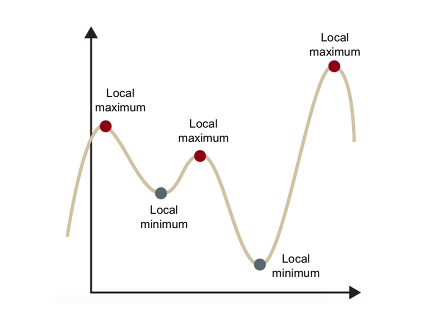

# Week2  
 

## Statistics/Math  
* 확률 모형과 확률 변수는 무엇일까요?  
확률변수(Random Variable) 란, 표본 공간의 각 단위 사건에 실수 값을 부여하는 함수이다. 이산확률변수, 연속확률변수 두가지 경우가 있다.  
확률모형이란 확률변수를 이용하여 데이터의 분포를 수학적으로 정의한 모형이다. 보통 확률 분포 함수 또는 확률 밀도 함수를 주로 사용. ex) 가우시안 정규 분포  
* 누적 분포 함수와 확률 밀도 함수는 무엇일까요? 수식과 함께 표현해주세요.  
누적 분포 함수는 랜덤 변수가 특정 값보다 작거나 같을 확률을 나타내는 함수이다. '누적'이라는 이름은 특정 값보다 작은 값들의 확률을 모두 누적해서 구한다는 의미에서 붙여진 이름이다.
  
확률 변수가 임의의 실수 집합에 포함되는 사건의 확률이 다음과 같이 어떤 음이 아닌 함수의 적분으로 주어진다고 할때 이를 연속확률변수라고 하고 함수를 확률 밀도 함수라고 한다. 모든 실수값 x에 대해 f(x)>=0 이고 적분값이 1을 만족해야함. 

## Deep Learning  
* Tensorflow, PyTorch 특징과 차이가 뭘까요?  
tensorflow는 정적그래프이고 pytorch는 동적 그래프이다.  

* Data Normalization은 무엇이고 왜 필요한가요?  
feature들의 분포를 조절하여 균일하게 만드는 방법. 정규화가 필요한 이유는 데이터 feature간 차이가 심하게 나면 모델에 반영이 될수도 있기 때문. 장점: 학습속도가 개선되고 노이즈가 작아지므로 오버피팅 억제하고 데이터를 덜 치우치게 만듬.  

## Machine Learning  
* Local Minima와 Global Minima에 대해 설명해주세요.  
  
cost function에서 global minima는 에러가 최소화되는 점이고 local minima는 에러가 최소가 될 수 있는 후보가 되는 지점 중 global minima를 뺀 지점을 말함. local minima는 자칫 에러가 최소화되는 지점이라고 착각할 수 있음.  
* 차원의 저주에 대해 설명해주세요.  
차원의 저주란 데이터 차원이 증가할수록 해당 공간의 크기가 기하급수적으로 증가하여 데이터 간 거리가 기하급수적으로 멀어지고 희소한 구조를 갖게 되는 현상. 차원을 증가시킨만큼 데이터를 추가하거나 차원축소 알고리즘으로 차원을 축소해야함  

## Python  
* What type of language is python? Programming or scripting?  
파이썬은 스크립트 언어이고 프로그래밍 언어로도 볼 수 있음. 일반적인 경우 프로그래밍언어로 분류 함. 스크립트 언어: 컴파일이 필요없이 실행될수 있는 명령어의 집합.  
* Python an interpreted language. Explain.  
인터프리터 언어는 실행시간 전에 machine-level-code를 만드는 컴파일 언어와 다르게 소스코드를 바로 실행하는 언어이다.  

## Network
* Frame, Packet, Segment, Datagram을 비교해주세요.  
  
packet이란 컴퓨터간 데이터를 주고받을 때, 네트워크를 통해 전송되는 데이터 조각을 패킷이라 부름.  
segment는 L4에서 헤더를 L5에서 받은 데이터에 붙인 것  
Datagram은 L3에서 헤더를 세그먼트에 붙인 것  
Frame은 L2에서 패킷에 헤더와 트레일러를 붙인 것  
* TCP와 UDP의 차이를 설명해주세요.  
먼저 공통점은 무결성 검사(오류검출) 헤더에 오류 검출 필드를 포함함.  
UDP는 가장 기본적인 두가지 기능만을 제공함. 비신뢰적인 서비스로서 프로세스에 의해서 전송된 데이터가 손상되지 않은채로 목적지에 도착하는 것을 보장하지 않음 또한 비연결형 서비스이고 오류검출은 선택사항임. 비연결형 서비스이기 때문에 연결설정이 필요없음. 따라서 연결을 설정하기 위한 지연이 없어서 더 많은 클라이언트를 수용할 수 있음. TCP에 비해 패킷 오버헤드가 작음. 단점은 신뢰적이지 않고 몇몇의 정보를 잃어버릴 수 있음.  
TCP는 가장 기본적인 두가지 기능도 제공하면서, 신뢰적인 데이터 전달(Reliable Data Transfer) 기능, 연결지향형 서비스, 혼잡제어(Congestion control) 등의 기능을 제공한다. 신뢰적인 데이터 전달은 흐름제어, 순서번호, 확인응답, 타이머 등의 기술을 사용하여 프로세스에게 데이터가 순서대로 정확히 전달되도록 하는 역할을 한다. 종단 시스템 간에 IP의 비신뢰적인 서비스를 프로세스 사이의 신뢰적인 데이터 전송 서비스로 만들수 있으며, TCP에서의 오류검출은 필수사항이다. 혼잡제어는 보내는 쪽(송신측)의 트래픽을 조절하여 스위치/링크의 혼잡을 방지하는 역할을 한다. 이는 특정 애플리케이션을 위해 제공하는 특정 서비스가 아니라, 전체를 위한 서비스로서, 혼잡한 네트워크 링크에서 각 TCP 연결이 링크의 대역폭을 공평하게 공유하여 통과하도록 해준다. 따라서, UDP는 속도증가와 지연 감소를 위해서 많이 사용되고, TCP는 신뢰성이 중요한 경우에 사용된다. 예를들어, UDP는 동영상 전송과 같이, 몇 프레임 정도 손실되어도 괜찮은 데이터 전송에 사용되고, TCP는 몇몇의 정보도 손실되어서는 안되는 애플리케이션에 이용된다.  

## Operating System  
* 캐시의 지역성에 대해 설명해주세요.  
캐시 메모리는 CPU의 처리 속도와 메모리의 속도 차이로 인한 병목현상을 완화하기 위해 사용하는 고속 버퍼 메모리이다. 주기억장치에 있는 데이터를 엑세스하려면 오랜 시간이 걸리는데 이를 줄이기 위해 데이터를 빠르게 액세스 할 수 있도록 중간에 캐시 메모리를 두는 것. 캐시 메모리는 적중률을 극대화하기 위해 데이터 지역성의 원리를 사용. 지역성이란 기억 장치 내의 정보를 균일하게 액세스하는 것이 아닌 어느 한순간에 특정 부분을 집중적으로 참조하는 특성이다. 데이터 지역성은 대표적으로 시간적 지역성, 공간적 지역성, 순차적 지역성으로 나눈다. 시간적 지역성은 CPU가 한 번 참조한 데이터는 다시 참조할 가능성이 높다. 공간적 지역성은 CPU가 참조한 데이터와 인접한 데이터 역시 참조될 가능성이 높다. 순차적 지역성은 분기가 발생하지 않는 한 명령어는 메모리에 저장된 순서대로 실행된다.  
* Thread-safe에 대해 설명해주세요. (hint: critical section)  
멀티 스레드 환경에서 여러 쓰레드가 동시에 동일한 코드를 실행시켰을 때 올바른 결과를 얻는 것을 말함. 공유 자원에 접근하는 코드 영역을 임계 영역이라고 하고 둘 이상의 프로세스가 동시에 임계영역에 접근하는 것을 막는 상호 배제를 해야 쓰레드 safe라고 볼 수 있다.  

## Database  
* DBMS를 정의하세요.  
다수의 사용자들이 데이터 베이스 내의 데이터에 접근 및 사용할 수 있도록 해주는 소프트웨어라 말한다. 장점은 데이터베이스 내 중복을 최소할 수 있고 같은 내용의 데이터를 여러 가지 구조로 지원해 줄 수 있는 DBMS의 정교한 기법으로 데이터베이스의 공용이 가능하다. 유효성을 검사하기 때문에 데이터 무결성을 유지할 수 있음. 단점은 컴퓨팅 시스템 자원의 소모량이 높음.
* RDBMS를 정의하고 장점에 대해 설명하세요.  
RDBMS는 관계형 데이터 베이스를 생성하고 수정하고 관리하는 소프트웨어라고 정의할 수 있음. RDBMS의 장점은 DB 수준에서의 ACID 트랙잭션을 사용한 쉬운 개발 방식을 사용. 조인이 필요한 경우 확장성을 제약함.  