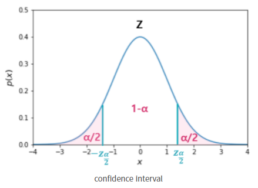

## Statistics/Math  
* 신뢰 구간의 정의는 무엇인가요?  
**keyword** : 포함  
신뢰구간은 모수가 실제로 포함될 것으로 예측되는 범위이다. 신뢰구간은 주어진 표본을 사용하여 구한 구간 안에 실제 모집단의 특성치(모평균)이 포함될 가능성이 1-a 임을 의미한다. 즉 신뢰 수준 95%라는 의미는 n개의 표본을 사용하여 신뢰구간을 구하는 과정을 100회 반복하였을 때 그중 95개의 구간은 실제 모수를 포함한다는 것을 뜻한다. (신뢰수준은 방법의 정확도, 참 값을 구하기 위한 작업을 많이 반복했을 때 참 값이 특정 벙위에 있을 비율)  
  
   

* p-value를 모르는 사람에게 설명한다면 어떻게 설명하실 건가요?  
p-value란 검정 통계량에 관한 확률인데, 우리가 얻은 검정 통계량보다 크거나 같은 값을 얻을 수 있을 확률을 의미한다. p-value는 1종 오류를 범할 확률을 말한다. 1 종오류란 귀무가설이 참인데 기각한 경우. 귀무가설: 모집단의 특성에 대해 옳다고 제안하는 잠정적인 주장 ex) ~와 차이가 없다, ~의 효과는 없다, ~와 같다.  

## Deep Learning  
* 하이퍼 파라미터는 무엇인가요?  
최적의 훈련 모델을 구현하기 위해 모델에 설정하는 변수. 사용자가 직접 설정해주는 값을 뜻함. ex) 학습률, 손실 함수, 일반화 파라미터, 미니배치 크기 등  
* Weight Initialization 방법에 대해 말해주세요. 그리고 무엇을 많이 사용하나요?  
    * Lecun Initialization  
    Lenet의 창시자 LeCun이 제시한 방법으로 들어오는 노드 수에 대해 정규 분포와 균등 분포를 따르는 방법이 있음.  
        * 정규분포  
          
        * 균등분포  
          
    * Xavier Initialization  
    구조는 Lecun의 초기화 방법과 유사하지만 다음 층의 노드 수도 사용하고, 많은 연구를 통해 가장 최적화된 상수값 또한 찾음.  
        * 정규분포  
          
        * 균등분포  
          
    * He Initialization  
    ReLu를 활성화 함수로 사용시 Xavier 초기값 설정이 비효율적인 결과를 보여서 사용하는 방법. ReLU와 함께 많이 사용되는 방법이고 LeCun 방법과 같지만 상수를 다르게 하고 들어오는 노드만 고려함.  
        * 정규분포  
          
        * 균등분포  
          
   

## Machine Learning  
* LSA, LDA, SVD 등의 약자들이 어떤 뜻이고 서로 어떤 관계를 가지는지 설명할 수 있나요?  
    * LSA(Latent Semantic Analysis)  
    잠재 의미 분석을 말하고 주로 토픽 모델링에 자주 사용되는 기법이다. 문서 집합에 숨어 있는 주제를 찾아내는 텍스트 마이닝기법 중 하나이다.  
    * LDA(Latent Dirichlet Allocation)  
    토픽모델링 기법 중 하나이다. 지도학습에서 적용하는 차원 축소 기법이자 입력 데이터의 클래스를 최대한 분리할 수 있는 축을 찾는 기법이다.  
    * SVD(Singular Value Decomposition)  
    정사각행렬이 아닌 m*n 형태의 다양한 행렬을 분해하며, 이를 특이값 분해라 한다. 이때 분해되는 행렬은 두 개의 직교 행렬과 하나의 대각행렬이며, 두 직교행렬에 담긴 벡터가 특이벡터이다.  
* Markov Chain을 고등학생에게 설명하려면 어떤 방식이 제일 좋을까요?  
마코프 체인은 마코프 성질을 지닌 이산 확률 과정이다. n+1회의 상태는 오직 n회에서의 상태, 혹은 그 이전 일정 기간의 상태에만 영향을 받는 것을 의미한다.  