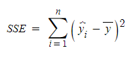

## Statistics/Math  
* R square의 의미는 무엇인가요?  
**keyword** : 독립변수, 종속변수  
R-square는 결정계수로 회귀 모델에서 독립변수가 종속변수를 얼마만큼 설명해 주는지를 가리키는 지표이다.  
  
SST(Total Sum of Squares)  
  
관측값에서 관측값의 평균(추정치의 평균)을 뺀 결과의 총합  
SSE(Explained Sum of Squares)  
  
추정값에서 관측값의 평균(혹은 추정치의 평균)을 뺀 결과의 총합  
SSR(Residual Sum of Squares)  

관측값에서 추정값을 뺀 값  

* 평균(mean)과 중앙값(median)중에 어떤 케이스에서 뭐를 써야할까요?  
**keyword** : 전체, 편차  
평균 : 모든 관측값의 합을 자료의 개수로 나눈 것. 평균은 전체 관측값이 반영되므로 대표값으로 가치가 있다. 평균 근처에 표본이 몰려있는 상황에는 유용 그러나 극단적인 값에 영향을 많이 받음.  
중앙값 : 전체 관측값을 크기 순으로 배열했을 때 가운데 위치한 값. 가운데 위치한 값 말고는 중요하지 않음. 평균에 비해 관측값들의 변화에 민감하지 않음. 유용한 경우는 표본의 편차, 왜곡이 심한 경우.  

## Deep Learning  
* 볼츠만 머신은 무엇인가요?  
**keyword** : 가시층, 은닉층, 완전그래프  
볼츠만 머신은 가시층과 은닉층 두개의 층으로 신경망을 구성하는 방법이다. 볼츠만 머신은 모든 뉴런이 연결되어 있는 완전 그래프 형태이고 제한된 볼츠만 머신은 같은 층의 뉴런이 연결되어 있지 않은 모양이다.  
* TF, PyTorch 등을 사용할 때 디버깅 노하우는?  
오류가 날꺼 같은 지점에서 print문을 이용하거나 디버깅 포인트로 잡기.  
   
   

## Machine Learning  
* 텍스트 더미에서 주제를 추출해야 합니다. 어떤 방식으로 접근해 나가시겠나요?  
LDA 방법  
문서의 집합에서 토픽을 찾아내는 대표적인 알고리즘. 문서들은 토픽들의 혼합으로 구성되어 있고 토픽들은 확률분포에 기반하여 단어들을 생성한다고 가정. 데이터가 주어지면 LDA는 토픽을 문서가 생성되던 과정을 역추적. 각 문서의 토픽 분포와 각 토픽 내의 단어 분포를 추정  
https://huidea.tistory.com/130
* SVM은 왜 반대로 차원을 확장시키는 방식으로 동작할까요? SVM은 왜 좋을까요?  
장점 : 분류와 회기에 모두 사용할 수 있다. 신경망 기법에 비해 오버피팅 정도가 낮다. 예측의 정확도가 높다. 저차원과 고차원 모두에 잘 작동한다.  