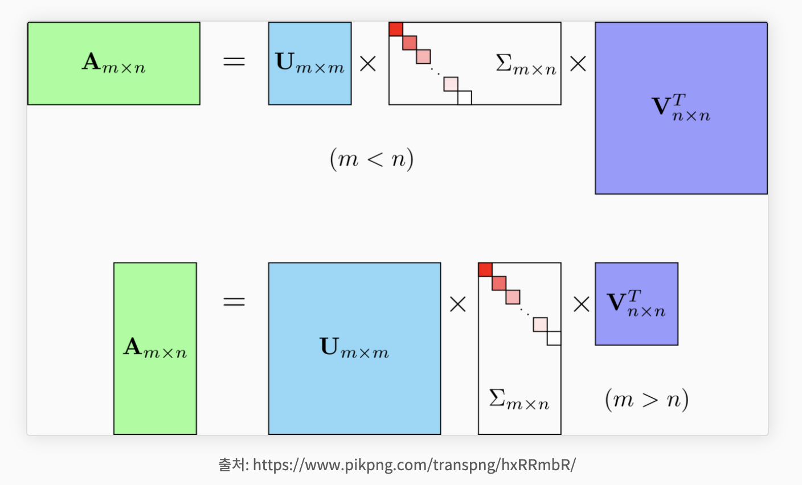
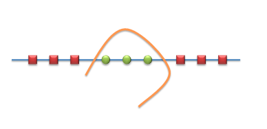
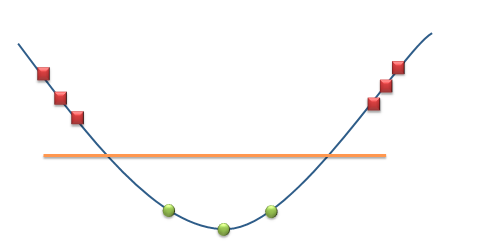

# Machine Learning  

## Questions  
* [알고 있는 metric에 대해 설명해주세요. (ex. RMSE, MAE, recall, precision ...)](#1)  

* [정규화를 왜 해야할까요? 정규화의 방법은 무엇이 있나요?](#2)  

* [Local Minima와 Global Minima에 대해 설명해주세요.](#3)  

* [차원의 저주에 대해 설명해주세요.](#4)  

* [dimension reduction기법으로 보통 어떤 것들이 있나요?](#5)

* [PCA는 차원 축소 기법이면서, 데이터 압축 기법이기도 하고, 노이즈 제거기법이기도 합니다. 왜 그런지 설명해주실 수 있나요?](#6)

* [LSA, LDA, SVD 등의 약자들이 어떤 뜻이고 서로 어떤 관계를 가지는지 설명할 수 있나요?](#7)

* [Markov Chain을 고등학생에게 설명하려면 어떤 방식이 제일 좋을까요?](#8)

* [텍스트 더미에서 주제를 추출해야 합니다. 어떤 방식으로 접근해 나가시겠나요?](#9)

* [SVM은 왜 반대로 차원을 확장시키는 방식으로 동작할까요? SVM은 왜 좋을까요?](#10)

  

## Answers
### #1

**Keyword** : MSE : 오차 제곱의 합의 평균 / 이상치를 잡아내는데 효과적

대표적으로 MSE가 있습니다. MSE는 오차를 제곱하여 평균을 낸 metric입니다. 오차에 제곱을 하여 연산을 하기 때문에 이상치(outlier)를 잡아내는데 효과적이라고 알고 있습니다.

### #2

**Keyword** : 동일한 정도의 스케일(중요도)로 반영해주는 것이 목적 / 예시로 MinMaxScaler

정규화는 모델에 들어가는 모든 데이터가 동일한 정도의 중요도로 반영되도록 하기 위해 사용합니다. 방법에는 모든 feature에 대해 0과 1 사이의 값으로 변환하는 MinMaxScaler가 있습니다. 

++ **정규화에는 다양한 정의**가 있는 것 같다. 아래 사이트에서 말한 것에 따르면 Normalization과 Standardization 관점에서 조사를 했던 것 같다.

https://realblack0.github.io/2020/03/29/normalization-standardization-regularization.html

### #3

말 그대로 local minima는 **특정 범위 내의 최소값**, global minima는 **전 구간에서의 최소값**입니다. 우리는 학습을 진행할 때 local minima에 빠지지 않고 **global minima를 찾는 것을 목적**으로 합니다.

### #4

데이터 학습을 위한 차원이 증가하면서, 학습 데이터 수가 차원의 수보다 적어져 성능이 저하되는 현상을 말합니다. KNN알고리즘에서 주로 발생합니다.

### #5

차원 축소 기법에는 feature selection과 feature extraction 두 가지 방식이 있습니다. Feature selection은 EDA를 통해 유의미한 Feature를 고르는 방식을 사용하고, feature extraction은 PCA 기반의 방법으로 유의미한 feature로 압축을 합니다.

### #6

cnn의 1x1 커널과 같이 차원을 축소시켜  불필요한 정보를 제거하여 유의미한 feature만 남도록 하는 방법론으로 이 때 노이즈가 제거된다고 생각합니다.

CNN에서 1x1 kernel의 역할과 비슷한지

### #7

토픽 모델링 : document에서 숨어 있는 '주제'를 찾아내는 텍스트 마이닝 기법

토픽 모델링에 자주 사용되는 기법으로 LSA(latent semantic analysis)와 LDA(latent dirtchlet allocation)이 있다 ! 

LDA : 지도 학습에서 적용되는 차원 축소 기법, 입력 데이터의 정답을 최대한 분리할 수 있는 축을 찾는 기법

LSA : 잠재적 의미 분석

기존에는 단어의 빈도 수만으로 문서의 주제를 찾아냈다. -> 단어의 의미를 정확하게 고려하지 못한다는 단점.. 해결하기 위해 나옴 ! SVD를 활용해 문서의 함축적의미를 찾아내는 기법

이를 이해하기 위해서는 SVD(Singular Value Decomposition)(특이값 분해)에 대한 이해가 필요함. 

특이값 분해는 모든 직각 행렬에 대해 가능 !

이를 이해하기 위해서는 고유 벡터, 고유 값에 대한 이해가 필요하다 ! v라 열 벡터에 선형 변환 A를 해준 결과가 열 벡터v의 상수배(lambda)와 동일하다면, 선형 변환 A에 대하여 v는 고유 벡터, 람다는 고유 값이다 ! 라고 할 수 있음 <- 정방행렬 A에 대해서만 가능 !

ref

https://huidea.tistory.com/126

[토픽모델링](https://bkshin.tistory.com/entry/NLP-9-%EC%BD%94%EC%82%AC%EC%9D%B8-%EC%9C%A0%EC%82%AC%EB%8F%84%EB%A5%BC-%ED%99%9C%EC%9A%A9%ED%95%9C-%EC%98%81%ED%99%94-%EC%B6%94%EC%B2%9C-%EC%8B%9C%EC%8A%A4%ED%85%9C)

### #8

예시 : 내일 날씨를 예측해야하는데 오늘의 날씨만 가지고 예측을 하는 방법이야.

ref

https://www.puzzledata.com/blog190423/

### #9

우선 텍스트 터미에서 가장 높은 빈도를 가지는 단어를 찾을 것 같습니다. 그리고 토픽 모델링 기법(LSA. LDA)를 사용할 것 같음 !

### #10

비선형 분류를 할 때 저차원보다는 고차원에서 maximum hyper plane(최대 초 평면)을 구하기가 쉽고, 일반적이기 때문이라고 생각합니다.

아래 두 그림으로 가장 쉽게 설명이 가능할 것 같음

REF

https://eehoeskrap.tistory.com/45