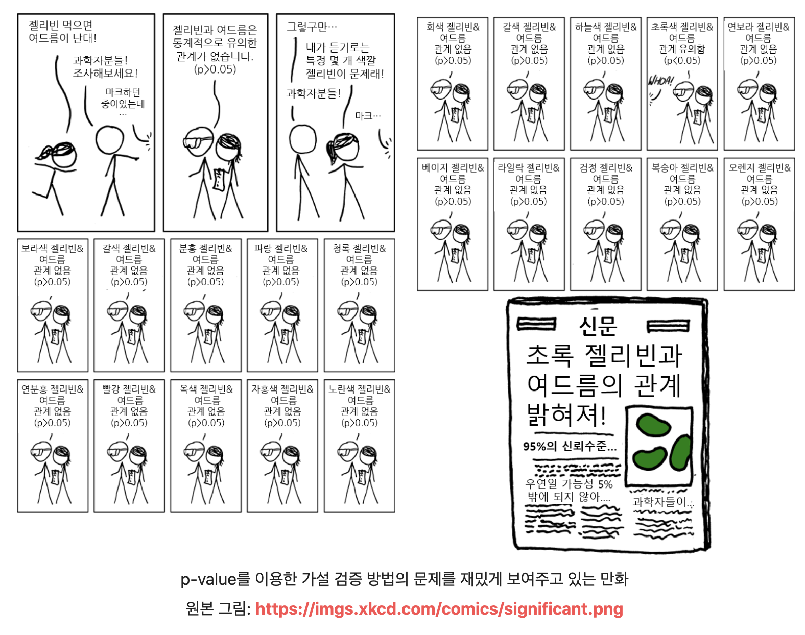

# Statistics/Math  

## Questions  

* [고유값(eigen value)와 고유벡터(eigen vector)에 대해 설명해주세요. 그리고 왜 중요할까요?](#1)  

* [샘플링(Sampling)과 리샘플링(Resampling)에 대해 설명해주세요. 리샘플링은 무슨 장점이 있을까요?](#2)  

* [확률 모형과 확률 변수는 무엇일까요?](#3)  

* [누적 분포 함수와 확률 밀도 함수는 무엇일까요? 수식과 함께 표현해주세요.](#4)  

* [조건부 확률은 무엇일까요?](#5)

* [공분산과 상관계수는 무엇일까요? 수식과 함께 표현해주세요.](#6)

* [신뢰 구간의 정의는 무엇인가요?](#7)

* [p-value를 모르는 사람에게 설명한다면 어떻게 설명하실 건가요?](#8)

* [R square의 의미는 무엇인가요?](#9)

* [평균(mean)과 중앙값(median)중에 어떤 케이스에서 뭐를 써야할까요?](#10)

* [중심극한정리는 왜 유용한걸까요?](#11)

* [엔트로피(entropy)에 대해 설명해주세요. 가능하면 Information Gain도요.](#12)

* 

  

  

## Answers  

### #1

### #2

### #3

확률 모형 : 확률 분포를 보다 단순하게 묘사하기 위해 고안한 것. ex) 정규 분포

확률 변수 : 표본 공간에서 **일정한 확률**을 가지고 발생하는 **사건**에 수치를 일대일 대응시킨 **함수**

REF

https://m.blog.naver.com/PostView.naver?isHttpsRedirect=true&blogId=vnf3751&logNo=220831745341

### #4

누적 분포 함수 : 랜덤 변수 X에 대한 확률이 정의가 되면 **X가 특정 값보다 작거나 같을 확률을 나타내는 함수**

확률 밀도 함수 : **연속확률변수**의 분포를 나타내는 함수

### #5

P(B|A)라고 한다면 사건 A가 일어났을 때 사건 B가 일어나는 확률을 말합니다. 

### #6

각 확률 변수들이 어떻게 퍼져있는지를 나타내는 것이 공분산

각각의 확률 변수들의 단위의 크기에 영향을 받는 공분산을 보완하기 위해 나온 것이 상관계수이다.

### #7

**Keyword** : 일정 확률(95%) 이상으로 어떠한 사건이 일어날 수 있는 구간 (?)

우리는 모집단에서 랜덤으로 추출된 표본을 가지고 표본 평균을 계산한다. 이 표본 평균의 개수는 굉장히 다양하므로 우리는 표본 평균의 분포를 보면 정규 분포 모양이라는 것을 볼 수 있다 !

정규분포에서 평균값을 중심으로 2*표준 분포 범위는 약 95%의 면적을 차지한다는 것을 알고 있다.

하지만 우리의 문제점은 모평균을 모른다는 것.. 알면 표준 평균의 분포를 구하지 않았을 것이다. 그래서 우리는 모평균 기준이 아니라 표본 평균 기준으로 +-2 표준편차 안에 모평균이 95% 확률로 들어올 수 있다는 것을 알 수 있다.

### #8

**Keyword** : 같은 모집단 위에서 나온 두 표본 평균이 있을 때 어떠한 통계량이 말이 되는지에 대한 척도

귀무가설을 기각한다는 것은 귀무가설과 현재 얻은 결과가 서로 양립할 수 없음을 의미.. p-value로 양립할 수 있는 정도를 표현 !

p-value는 확률값으로써 귀무가설과 현재 얻은 결과가 얼마나 일치한다고 할 수 있는지에 대해 말해준다.

-> ex) 젤리와 여드름은 통계적으로 유의한 관계를 가지고 있을 확률에 대한 정도 ? -> 정도를 측정하는 것이 p-value

ref

https://angeloyeo.github.io/2020/03/29/p_value.html

### #9

결정계수 R-Squared는 회귀 모델에서 독립변수가 종속변수를 얼마나 잘 설명해주는지 가리키는 지표다

R square이 높을수록 독립변수가 종속변수를 많이 설명한다는 뜻임. 하지만 종속변수를 잘 설명 못하는 변수가 추가되어도 증가하는 문제점이 있음 그래서 대안으로 adjusted r-squared를 사용함

### #10

극단적인 값(outlier)가 많을 경우는 중앙값을 사용하는 것이 더 맞고.. 고루 분포가 되어있다면 평균을 사용하는 것이 맞는 것 같습니다.

### #11

중심극한정리는 왜 유용한걸까요?

중심극한정리 : 모집단이 있을 때 표본 평균을 많이 뽑다 보면.. 이 표본 평균들의 분산이 정규 분포에 근사한다는 것을 말합니다. 중심극한정리가 중요한 이유는 모집단의 분포가 어떤 분포를 가지고 있던지 간에 표본의 크기가 충분히 크다면 표본 평균들의 분포가 모집단의 모수 기반으로한 정규 분포를 이룬다는 점을 이용하여, 특정 사건이 일어날 확률값을 계산할 수 있게 된다 !

-> 중심극한정리는 표본 평균들이 이루는 표본 분포와 모집단 간의 관계를 증명함으로써, 수집한 표본의 통계량을 이용해 모집단의 모수를 추정할 수 있는 수학적 근거를 마련해주기에 유용합니다.

ref 

https://drhongdatanote.tistory.com/57

### #12

엔트로피에 대해 설명해주세요. 가능하면 Information Gain도요 !

엔트로피 : 데이터 집합의 혼잡도를 의미

주어진 데이터 집합에서 서로 다른 종류의 레코드들이 섞여 있으면 엔트로피가 높고, 같은 종류의 레코드가 섞여 있으면 엔트로피가 낮다.

엔트로피 값은 0에서 1 사이의 값을 가지며 가장 혼잡할 때가 1, 반대가 0이다.

결정 트리 알고리즘에서는 엔트로피가 높은 상태에서 낮은 상태가 되도록 데이터를 특정 조건을 찾아 나무 모양으로 구분해나간다.

Information gain : 어떤 속성을 선택함으로 인해 데이터를 더 잘 구분하게 되는 것을 말한다 !

Ex) 수능 등급을 구분함에 있어 수학 점수가 체육 점수보다 변별력이 높다고 하자. 그렇다면 수학 점수 속성이 체육 점수 속성보다 정보이득이 높다고 말할 수 있다.

ref 

https://eehoeskrap.tistory.com/13