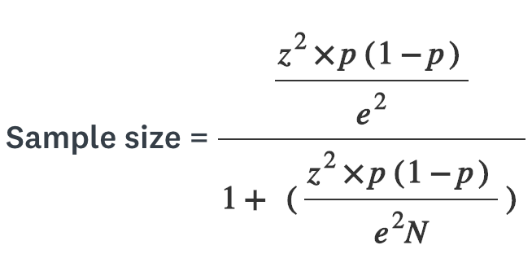

# 22년 1월 4주차

## Statistics/Math
* 아웃라이어의 판단하는 기준은 무엇인가요?  
    * Keyword: 데이터 패턴, IQR, 사분위 편차
    * Answer  
    일반적인 데이터 패턴과 매우 다른 패턴의 데이터인 이상치데이터(outlier)를 선별하기 위해서 대표적으로 IQR(Inter Quantile Range)을 사용한다.
    * Ref: [Blog](https://lsjsj92.tistory.com/556)
* 필요한 표본의 크기를 어떻게 계산합니까? 
    * Keyword: 모집단 크기, 오차 한계, 표집 신뢰 수준
    * Answer  
    **모집단 크기, 오차 한계, 표집 신뢰 수준을 구하고 아래의 식에 대입하면 최소 표본 크기를 계산할 수 있다.**  
      
    오차 한계: 설문조사 결과가 전체 모집단의 관점을 반영하는 정도를 얼마나 기대할 수 있는지를 보여주는 백분율입니다. 오차 한계가 작을수록 주어진 신뢰 수준의 정확한 답변을 받을 확률에 더 가까워집니다.  
    표집 신뢰 수준: 모집단이 특정 범위 내의 답변을 선택할 것이라고 얼마나 확신할 수 있는지를 나타내는 백분율입니다. 예를 들어 95% 신뢰 수준은 결과가 x 및 y 사이에 있을 거라고 95% 확신할 수 있다는 뜻입니다.

    * Ref: [Blog](https://ko.surveymonkey.com/mp/sample-size-calculator/)

## Deep Learning
* SGD, RMSprop, Adam에 대해서 아는대로 설명한다면?  
    * Keyword: Mini-batch, Momentum, Gt
    * Answer  
        * SGD: mini batch를 사용해 학습. 부정확해도 계삭속도가 월등하게 빨라서 빠르게 학습 가능.
        * NAG(Nesterov Accelerated Gradient): Momentum을 활용해 먼저 다음 step을 보고, 해당 step의 기울기를 활용해 update. Momentum을 활용해 빠르게 학습하면서, 최적의 파라미터를 지나칠 가능성을 줄여준다.
        * Adaptive Gradient(Adgrad): 지속적으로 변화하는 parameter는 최적값에 가까워졌을 것이고, 변하지 않는 parameter에는 더 큰 변화를 줘야 한다. $$G_t= gradient들의 sum\ of\ square$$
        * RMSDrop: Adgrad의 Gt에 지수이동평균 적용.
        * Adam: RMSDrop과 Momentum을 합친 기법.
    * Ref: [Blog](https://onevision.tistory.com/entry/Optimizer-%EC%9D%98-%EC%A2%85%EB%A5%98%EC%99%80-%ED%8A%B9%EC%84%B1-Momentum-RMSProp-Adam)
    * SGD에서 Stochastic의 의미는?  
        * Keyword:
        * Answer
        Stochatic(확률적)의 의미는 mini batch를 통해 전체 batch에 대한 내용을 추론할 때, 각 배치를 포함하는 하나의 예가 무작위로 선택된다는 것.
        * Ref: [Blog](https://everyday-deeplearning.tistory.com/entry/SGD-Stochastic-Gradient-Descent-%ED%99%95%EB%A5%A0%EC%A0%81-%EA%B2%BD%EC%82%AC%ED%95%98%EA%B0%95%EB%B2%95)
    * 미니배치를 작게 할때의 장단점은?  
        * Keyword:
        * Answer  
            * 장점: 기울기 업데이트의 빈도가 줄어들어서, 정확한 업데이트를 할 수 있다.
            * 단점: outlier로 인해 기울기가 급격하게 변할 수도 있는데, outlier에 대한 영향을 많이 받는다.
        * Ref: [Blog](https://shate-programming.tistory.com/37)
  * 모멘텀의 수식을 적어 본다면?  
        * Keyword:  
        * Answer  
        Vt​ =m × Vt−1 ​− η∇ω​J(ωt​)  
        * Ref: [Blog](https://onevision.tistory.com/entry/Optimizer-의-종류와-특성-Momentum-RMSProp-Adam)

## Machine Learning
* K-means의 대표적 의미론적 단점은 무엇인가요? (계산량 많다는것 말고)  
    * Keyword:
    * Answer  
        * k 값을 임의로 정해야 하고, 처음의 centroid도 임의로 정해야 한다. 또한 처음의 centroid를 어떻게 정하느냐에 따라 cluster 결과가 민감하게 변한다.
        * Outlier에 민감하다. 몇 개의 점이 굉장히 멀리 떨어져 있다면 이에 맞춰 centroid를 정하기 때문이다.
        * 원(혹은 구)형(spherical)의 cluster만 찾을 수 있다. 아래 예시와 같이 cluster의 모양이 원형이 아닐 때는 정확한 결과를 도출하지 못한다.
    * Ref: [Blog](https://process-mining.tistory.com/122)
* L1, L2 정규화에 대해 설명해주세요.  
    * Keyword:
    * Answer  
    딥러닝 모델 과적합을 막는 방법에는 세가지가 있는데 
    - batch normalization. (배치정규화)
    - weight regularization (정규화)
    - dropout (학습당시 랜덤으로 절반의 뉴런만 사용하기)  
    이 중 두번째에 해당되는 것이 L1, L2 regularization 이다.
        * L1 Regularization: L1 norm으로 정규화. 중요한 가중치만 남긴다. 
        * L2 Regularization: L2 norm으로 정규화. 전체적인 weight의 크기를  줄여준다.
    * Ref: [Blog](https://huidea.tistory.com/154)

## Python
* What is pep 8?  
    * Keyword:
    * Answer  
    파이썬 개선 제안서, 파이썬 코드를 어떻게 구상할 지 알려주는 스타일 가이드  
    다른 사람과 원활하게 협업하려면 공통된 스타일 공유가 필요  
    일관성 있는 스타일은 나중에 수정하기도 쉽다.  
    * Ref: [Blog](https://wayhome25.github.io/python/2017/05/04/pep8/)

* How is memory managed in Python?  
    * Keyword:
    * Answer  
    Python Memory Manager가 모든 메모리 관련 사항을 관리해준다. 모든 것을 객체로 치부한다. 따라서 C와는 다르게 메모리에 직접 값이 할당되지 않고, heap에 해당 object가 생성된 후에 stack에서 이를 가르키는 형태로 값이 할당된다.
    * Ref: [Blog](https://pro-jy.tistory.com/38)
